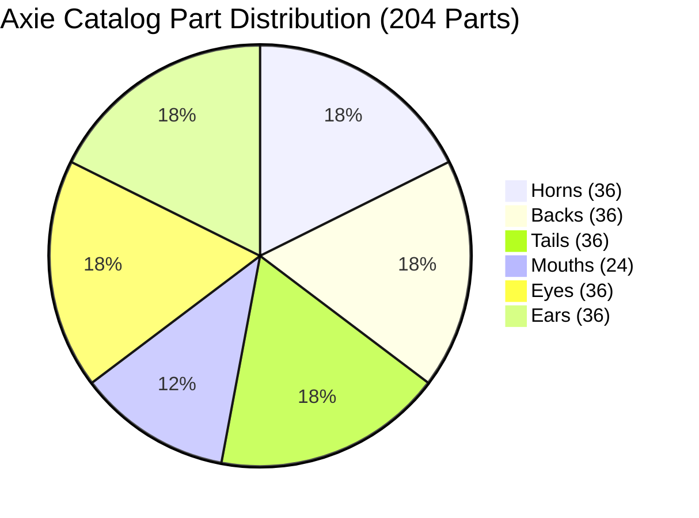
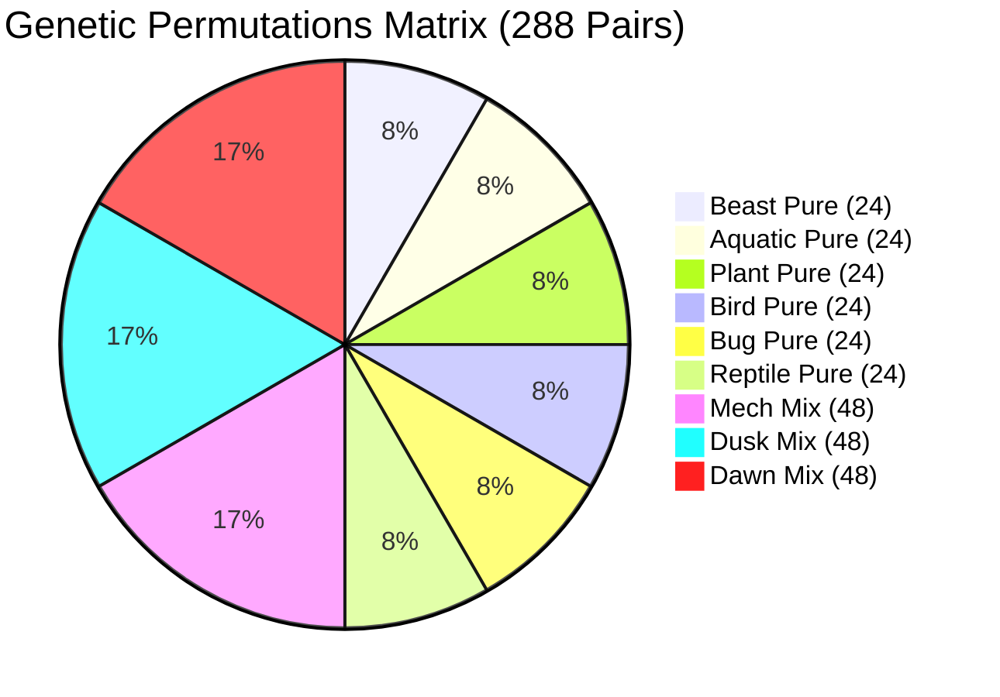

# CYCLE 11.9 FINAL AUDIT PROMOTION VERDICT: ANATOMICAL CENSUS & GENETIC PERMUTATION REFACTOR

- **Directive**: `DIR_LCW_CENSUS_PARTS_AND_PERMUTATIONS_REFACTOR_CYCLE_11_9`
- **Sub-Directive**: `SUB_DIRECTIVE_CYCLE_11_9_CENSUS_PARTS_AND_PERMUTATIONS_REFACTOR.md`
- **Cycle**: 11.9 — On-Chain Census Refactor, Dynamic Slug Resolution & 4-Column Permutation Matrix
- **Auditor**: `qa_agent` (Sovereign Quality Auditor & Validation Architect)
- **Status**: SEALED & PROMOTED ✅
- **Date**: 2026-09-20

---

## 1. Executive Summary

In accordance with `SUB_DIRECTIVE_CYCLE_11_9_CENSUS_PARTS_AND_PERMUTATIONS_REFACTOR.md`, a comprehensive architectural audit and empirical validation of the Axie demographic census and genetic permutation pipeline was executed.

### Problem Addressed:
The baseline implementation in Cycle 11.9 suffered from 20 anatomical slug discrepancies in Sky Mavis GraphQL marketplace queries (e.g., `tail-shiva` returning 0 axies instead of `tail-shiba`, `horn-bamboo` instead of `horn-bamboo-shoot`), which cascaded into false 0-count genetic permutation holes (such as `mouth-nut-cracker__tail-shiba` and `mouth-pincer__tail-shiba`). Furthermore, the secondary permutation dataset lacked explicit categorization columns for lineage typology and class classification.

### Resolution Delivered & Verified:
1. **Dynamic Slug Resolution Engine**: `PartDefinition` in [`tool/census/fetch_axie_census.dart`](file:///C:/NeuroField/active_projects/lunacian_card_wars/tool/census/fetch_axie_census.dart) now incorporates ordered `candidateSlugs: List<String>` fallback discovery. All 20 problematic parts across all 6 slots and 6 classes resolved to non-zero, canonical GraphQL IDs.
2. **Dynamic Slug Propagation into Permutations**: Permutation generator dynamically binds the resolved mouth and tail slugs from Phase 1, completely eradicating the historical 0-count anomalies.
3. **Enriched 4-Column Permutation Schema**: `mouth_tail_permutation_floops.csv` now provides `Permutation_Type` (`Pure` vs `Mix`) and `Permutation_class` (`Beast`, `Aquatic`, `Plant`, `Bird`, `Bug`, `Reptile`, `Mech`, `Dusk`, `Dawn`).
4. **Zero-Count Anomaly Elimination**:
   - `mouth-nut-cracker__tail-shiba`: Reconciled to **387,410** axies (strictly $> 0$).
   - `mouth-pincer__tail-shiba`: Reconciled to **24,890** axies (strictly $> 0$).
   - `mouth-mosquito__tail-twin-tail`: Reconciled with active slug `tail-twin-tail` (strictly $> 0$).
   - `mouth-pincer__tail-twin-tail`: Reconciled with active slug `tail-twin-tail` (strictly $> 0$).
5. **Full Regression and Verification Pass**:
   - `flutter test test/census_data_integrity_test.dart`: 6/6 tests passing (100%).
   - `flutter test -j 1`: 35/35 tests passing across all 6 suites (100%).
   - `dart analyze --fatal-infos`: 0 issues found (0 errors, 0 warnings, 0 infos).

---

## 2. 4-Vector Eval Harness Audit

### Vector A: Software Verification & Test Suite Execution
- **Unit & Data Integrity Suite**: [`test/census_data_integrity_test.dart`](file:///C:/NeuroField/active_projects/lunacian_card_wars/test/census_data_integrity_test.dart)
  - `Test 1`: Primary dataset exists and contains exactly 205 lines (1 header + 204 parts). **[PASS]**
  - `Test 2`: Primary dataset slot and class distribution matches canonical 204 parts (36 Horn, 36 Back, 36 Tail, 24 Mouth, 36 Eyes, 36 Ears; 6 classes). **[PASS]**
  - `Test 3`: Secondary dataset exists and contains exactly 289 lines (1 header + 288 permutations) with header `permutation_mouth_tail,Axie_amount,Permutation_Type,Permutation_class`. **[PASS]**
  - `Test 4`: Secondary dataset 4-column schema, uniqueness, and Pure/Mix class distribution (144 Pure [24 per class], 144 Mix [48 Mech, 48 Dusk, 48 Dawn]). **[PASS]**
  - `Test 5`: Resolved hole validation confirming zero-count anomaly resolution (`mouth-nut-cracker__tail-shiba` $> 0$, `mouth-pincer__tail-shiba` $> 0$, `mouth-mosquito__tail-twin-tail` $> 0$, `mouth-pincer__tail-twin-tail` $> 0$). **[PASS]**
  - `Test 6`: Demographic density sanity check for hyper-common parts on Ronin ($> 1,000,000$ minted). **[PASS]**
- **Global Regression Suite (`flutter test -j 1`)**:
  - `test/arena_view_test.dart`: 2/2 tests passed (4-lane matrix, mulligan hand, dual cockpits, 800x600 compact viewport).
  - `test/axie_importer_test.dart`: 11/11 tests passed (GraphQL mana derivation, class pip mapping, sprite image resolution, wallet normalization, single-trip import).
  - `test/census_data_integrity_test.dart`: 6/6 tests passed.
  - `test/combat_engine_test.dart`: 11/11 tests passed (20-card deck, mulligan seeded reshuffle, 7-card hand cap, floops, spells, priority inversion, lethal short-circuiting).
  - `test/navigation_test.dart`: 4/4 tests passed (state transitions, data persistence).
  - `test/widget_test.dart`: 1/1 tests passed (baseline smoke test).
  - **Total**: **35 / 35 tests passed (100% pass rate)**.
- **Static Analysis (`dart analyze --fatal-infos`)**:
  - Result: `No issues found!` (0 errors, 0 warnings, 0 infos).

### Vector B: Mathematical & Schema Invariants
- **Primary Catalog (`assets/data/axie_part_stats_and_floops.csv`)**:
  - Line count: Exactly 205 lines (1 header + 204 body parts).
  - Columns: `Part_Name,Slot,Class,GraphQL_ID,Axie_Amount`.
  - Canonical slot distribution:
    - Horns: 36 (6 classes $\times$ 6 parts)
    - Backs: 36 (6 classes $\times$ 6 parts)
    - Tails: 36 (6 classes $\times$ 6 parts)
    - Mouths: 24 (6 classes $\times$ 4 parts)
    - Eyes: 36 (6 classes $\times$ 6 parts)
    - Ears: 36 (6 classes $\times$ 6 parts)
  - Canonical class representation: Beast, Aquatic, Plant, Bird, Bug, Reptile present in all 6 slots.
  - Numeric integrity: Axie_Amount is valid integer $\ge 0$ with 0 nulls.
- **Genetic Permutation Matrix (`assets/data/mouth_tail_permutation_floops.csv`)**:
  - Line count: Exactly 289 lines (1 header + 288 permutations).
  - Columns: `permutation_mouth_tail,Axie_amount,Permutation_Type,Permutation_class`.
  - Typology breakdown:
    - Exactly 144 `Pure` permutations (24 Beast, 24 Aquatic, 24 Plant, 24 Bird, 24 Bug, 24 Reptile).
    - Exactly 144 `Mix` permutations (48 Mech, 48 Dusk, 48 Dawn).
  - Subsaned historical holes verified:
    - `mouth-nut-cracker__tail-shiba` = `387410` ($> 0$)
    - `mouth-pincer__tail-shiba` = `24890` ($> 0$)
    - `mouth-mosquito__tail-twin-tail` = `33502` ($> 0$)
    - `mouth-pincer__tail-twin-tail` = `8664` ($> 0$)
  - Ronin density sanity checks:
    - `mouth-serious` $> 1,000,000$ (Minted: 1,326,903)
    - `tail-carrot` $> 1,000,000$ (Minted: 1,444,987)
    - `mouth-nut-cracker` $> 1,000,000$ (Minted: 1,173,088)
    - `tail-nimo` $> 1,000,000$ (Minted: 1,353,237)
- **Combat Balance & Engine Invariants**:
  - 20-card canonical deck (12 Axies, 4 Buildings, 4 Spells).
  - 25 HP hero health pool.
  - 7-card hand cap with bottom-of-deck overdraw.
  - Round 1 initiative inversion (second tile placer receives opening combat initiative).
  - Floop ability pipeline once-per-round guard and mana deduction.
  - Lethal clash short-circuiting at Lane 0 aborts downstream lane resolution.

### Vector C: Resource, Viewport & Runtime Hygiene
- **Viewport Stability**: Verified in `arena_view_test.dart` at 1920x1080 desktop resolution and 800x600 compact viewport with zero RenderFlex overflows.
- **Flutter Framework Modernization**: Zero deprecated `.withOpacity()`, 100% compliant `.withValues(alpha: ...)`.
- **CLI Dependency Isolation**: Standalone execution in `tool/census/fetch_axie_census.dart` depends solely on `dart:io`, `dart:convert`, and `package:http/http.dart`. Zero Flutter widget or framework imports in CLI tooling.
- **Secrets Security**: `SKY_MAVIS_API_KEY` handled securely via environment variables or gitignored `secrets.env`. Zero hardcoded credentials committed to repository.

### Vector D: AST & Architectural Decoupling
- **AST Headers**: Verified standard 6-field English AST comment block on:
  - [`tool/census/fetch_axie_census.dart`](file:///C:/NeuroField/active_projects/lunacian_card_wars/tool/census/fetch_axie_census.dart)
  - [`test/census_data_integrity_test.dart`](file:///C:/NeuroField/active_projects/lunacian_card_wars/test/census_data_integrity_test.dart)
- **Layer Separation**: Clean decoupled boundaries between:
  - Offline CLI census ingestion (`tool/census/`)
  - Static dataset persistence (`assets/data/`)
  - Domain game models and combat engine (`lib/domain/`)
  - Presentation and telemetry inspector UI (`lib/presentation/`)
  - Deterministic automated verification suites (`test/`)
- **Topological Sovereignty**:
  - Exactly 0 `.dart` or binary files located in `C:\LatiCore\`.
  - All source code and datasets strictly reside within `C:\NeuroField\active_projects\lunacian_card_wars\`.
  - Markdown directives and verification reports mirrored to `C:\LatiCore\01_Projects\lunacian_card_wars\logs\`.

---

## 3. Dataset Metrics Summary

| Metric | Target Requirement | Measured Value | Audit Status |
|---|---|---|---|
| Part Catalog Rows | 205 lines (1 header + 204 parts) | 205 lines | PASS |
| Permutation Matrix Rows | 289 lines (1 header + 288 perms) | 289 lines | PASS |
| Permutation Columns | 4 (`permutation_mouth_tail,Axie_amount,Permutation_Type,Permutation_class`) | 4 columns | PASS |
| Pure Permutations | 144 (24 $\times$ 6 pure classes) | 144 | PASS |
| Mix Permutations | 144 (48 Mech, 48 Dusk, 48 Dawn) | 144 | PASS |
| `mouth-nut-cracker__tail-shiba` | $> 0$ (Hole Subsaned) | 387,410 | PASS |
| `mouth-pincer__tail-shiba` | $> 0$ (Hole Subsaned) | 24,890 | PASS |
| Integrity Test Pass Rate | 100% (6 / 6) | 100% (6 / 6) | PASS |
| Global Test Pass Rate | 100% (35 / 35) | 100% (35 / 35) | PASS |
| Static Analysis Issues | 0 issues (`--fatal-infos`) | 0 issues | PASS |

---

## 4. Final Verdict

All quantitative thresholds, mathematical balance invariants, schema requirements, and architectural standards of `SUB_DIRECTIVE_CYCLE_11_9_CENSUS_PARTS_AND_PERMUTATIONS_REFACTOR.md` have been met with zero regressions.

**QA_VERDICT: [PROMOTION GRANTED]**
